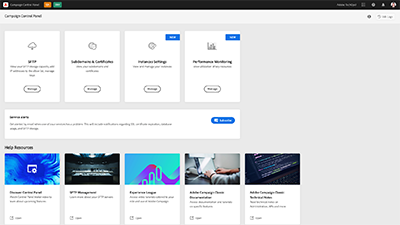
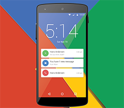

# Tutoriels sur Adobe Campaign Standard

Adobe Campaign offre une plateforme pour concevoir des expériences client cross-canal et propose un environnement pour l’orchestration visuelle de campagnes, la gestion d’interactions en temps réel et l’exécution cross-canal. Ce guide de l’utilisateur contient des vidéos et des tutoriels sur les nombreuses fonctionnalités d’Adobe Campaign Standard.

## Suggestions du personnel

<table>
<tr>
  <td>
    
    

      <a href="./communication-channels/email/profile-substitution.md">
    <strong>Substitution de profil - Test des e-mails à l’aide des profils ciblés (vidéo)</strong>
    </a>
    

    

    <em>Découvrez comment envoyer un BAT pour révision avec la représentation exacte du message que le profil reçoit.</em>
    

  </td>
   <td>
    
    

    <a href="https://experienceleague.adobe.com/docs/control-panel-learn/tutorials/control-panel-overview.html?lang=fr">
    <strong>Panneau de Contrôle (vidéos)</strong>
    </a>
    

    

    <em> Soyez plus efficace en tant qu’administrateur en gérant les paramètres et en suivant les utilisations de vos instances avec le Panneau de contrôle.</em>
    

  </td>
  <td>
    
    

      <a href="https://experienceleague.adobe.com/docs/campaign-standard-learn/getting-started-with-push-notifications-android/introduction.html?lang=fr">
    <strong>Tutoriel : Prise en main des notifications push pour Android™</strong>
    </a>
    

    

    <em>Ce tutoriel vous guide tout au long des étapes nécessaires à l'envoi de notifications push depuis Adobe Campaign et à la réception de ces notifications dans votre application Android™.</em>
    

  </td>
</tr>
</table>

