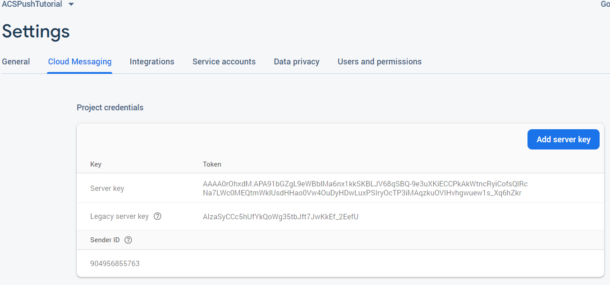

# Étape 1 - Création de l’application [!DNL Android] et configuration pour utiliser [!DNL Firebase Cloud Messaging]

Dans cette partie, vous allez créer une application [!DNL Android] pour recevoir les [!UICONTROL notifications push] envoyées depuis Adobe Campaign Standard. Pour recevoir les notifications push, l’application doit être enregistrée auprès de Google [!DNL Firebase Cloud Service].

1. Connectez-vous à votre compte [!DNL Firebase].

   [!DNL Firebase] est une plateforme mobile Google qui vous aide à développer rapidement des applications de haute qualité. Si vous n&#39;avez pas de compte [!DNL Firebase], créez-en un [d&#39;ici](https://firebase.google.com).

2. Lancement [!DNL Android Studio]
3. Cliquez sur **[!UICONTROL Fichier]** > **[!UICONTROL Nouveau]** > **[!UICONTROL Nouveau projet].**
4. Sélectionnez **[!UICONTROL Activité vide]** et cliquez sur **[!UICONTROL Suivant].**

   

5. Attribuez un nom significatif au projet.

   Pour les besoins de cette démonstration, nous avons nommé notre projet *[!DNL ACSPushTutorial]*

   

6. Acceptez les noms de package par défaut et cliquez sur **[!DNL Finish]** pour créer votre projet.
7. La structure de votre projet doit ressembler à la capture d’écran ci-dessous

   

8. Cliquez sur **[!UICONTROL Outils]** > **[!UICONTROL Firebase].** (cela ajoute le projet à [!DNL Firebase])
9. Cliquez sur **[!UICONTROL Configurer Firebase Cloud Messaging].**

   

10. Cliquez sur **[!UICONTROL Se connecter à Firebase].**
11. Une fois votre application connectée à Firebase, cliquez sur **[!UICONTROL Ajouter FCM à votre application].**
12. Cliquez sur **[!UICONTROL Accepter les modifications].**

   Lorsque vous ajoutez FCM à votre application, l’assistant a besoin de votre autorisation pour apporter des modifications à votre projet.

   ![[!DNL add-fcm-to-your-app]](assets/firebase-add-fcm-to-app.PNG)

Une fois l’intégration de votre application avec Firebase réussie, vous devriez recevoir un message comme celui illustré ci-dessous :

![[!DNL fcm-successfull]](assets/android-firebase-success.PNG)

[ Assurez-vous que votre projet est répertorié dans la  [!DNL Firebase ]console](https://console.firebase.google.com/)

## Configuration des paramètres [!UICONTROL Canal push]

1. Connexion à la console [!DNL Firebase]
2. Ouvrez le projet **[!UICONTROL ACSPushTutorial]** .
3. Cliquez sur l’icône **engrenage** et ouvrez les paramètres du projet.

   

4. Appuyez sur l’onglet **[!UICONTROL Cloud Messaging]** .
5. Copiez la clé du serveur

   

6. Connexion à votre instance Adobe Campaign Standard
7. Cliquez sur **[!UICONTROL Adobe Campaign]** > **[!UICONTROL Administration]** > **[!UICONTROL Canaux]** > **[!UICONTROL Application mobile].**
8. Sélectionnez la **[!UICONTROL propriété d’application mobile ] appropriée.**
9. Cliquez sur l’icône **[!DNL Android]** dans la section **[!UICONTROL Paramètres du canal push]** .
10. Collez la clé du serveur dans le champ Clé du serveur .

Si tout se passe bien, un message SUCCESS s’affiche.

Pour résumer, nous avons créé un [!DNL Android App] et connecté le [!DNL Android App] à [!DNL Firebase]. Nous avons ensuite connecté l’application mobile dans Adobe Campaign à l’application [!DNL Android App] en collant la clé de serveur de l’application [!DNL Android] dans l’application mobile dans Adobe Campaign Standard.
