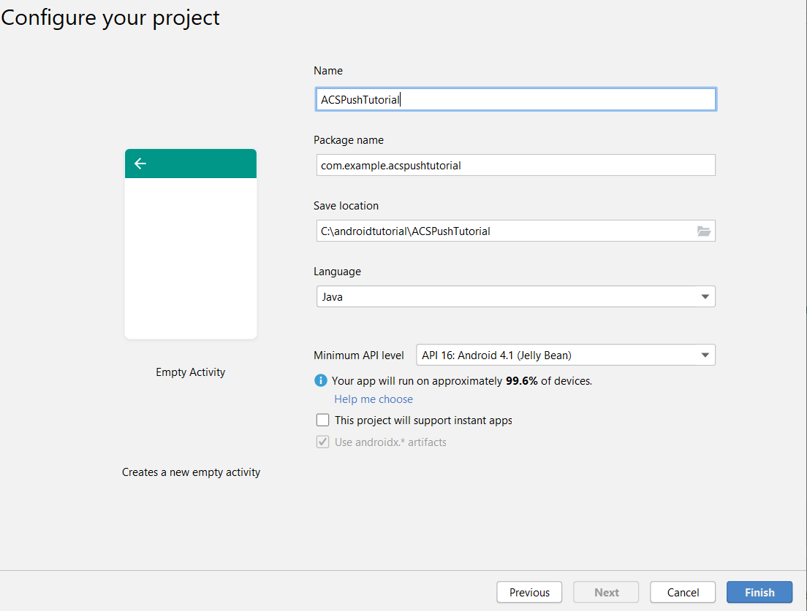
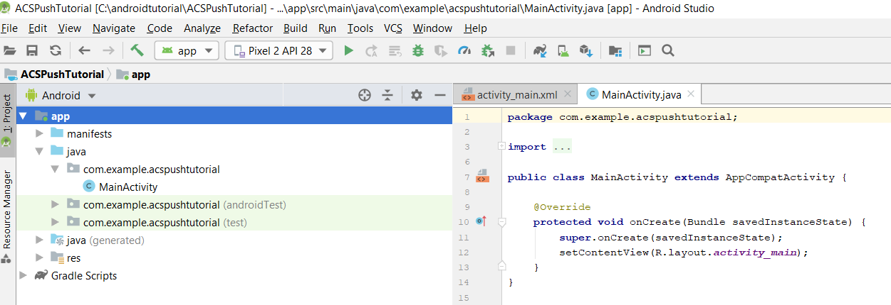
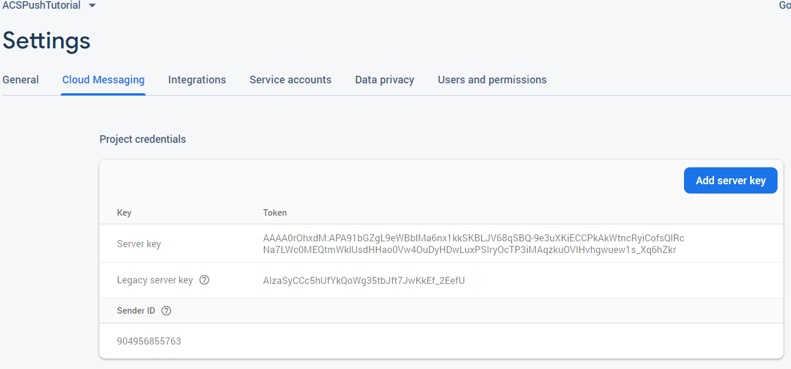

# Etape 1 - Créer [!DNL Android] application et la configurer pour l&#39;utiliser [!DNL Firebase Cloud Messaging]

Dans cette partie, vous allez créer [!DNL Android] application pour recevoir les [!UICONTROL notifications push] envoyées depuis Adobe Campaign Standard. Pour recevoir les notifications push, l’application doit être enregistrée auprès de Google [!DNL Firebase Cloud Service].

1. Connectez-vous à votre compte [!DNL Firebase].

   [!DNL Firebase] est une plateforme mobile Google qui vous permet de développer rapidement des applications de haute qualité. Si vous n’avez pas de compte [!DNL Firebase], veuillez en créer un [à partir d’ici](https://firebase.google.com).

2. [!DNL Android Studio] Launch
3. Cliquez sur **[!UICONTROL Fichier]** > **[!UICONTROL Nouveau]** > **[!UICONTROL Nouveau projet].**
4. Sélectionnez **[!UICONTROL Activité vide]** puis cliquez sur **[!UICONTROL Suivant].**

   

5. Attribuez un nom significatif au projet.

   Pour les besoins de cette démonstration, nous avons nommé notre projet *[!DNL ACSPushTutorial]*

   

6. Acceptez les noms de package par défaut et cliquez sur **[!DNL Finish]** pour créer votre projet.
7. La structure de votre projet doit ressembler à la capture d’écran ci-dessous

   

8. Cliquez sur **[!UICONTROL Outils]** > **[!UICONTROL Firebase].** (cela ajoute le projet à [!DNL Firebase])
9. Cliquez sur **[!UICONTROL Configurer Firebase Cloud Messaging].**

   

10. Cliquez sur **[!UICONTROL Connexion à Firebase].**
11. Une fois que votre application est connectée à Firebase, cliquez sur **[!UICONTROL Ajouter FCM à votre application].**
12. Cliquez sur **[!UICONTROL Accepter les modifications].**

   Lorsque vous ajoutez FCM à votre application, l’assistant a besoin de votre autorisation pour apporter des modifications à votre projet.

   ![[!DNL add-fcm-to-your-app]](assets/firebase-add-fcm-to-app.PNG)

Une fois l’intégration de votre application avec Firebase terminée, vous devriez recevoir un message comme celui illustré ci-dessous :

![[!DNL fcm-successfull]](assets/android-firebase-success.PNG)

[Vérifiez que votre projet est répertorié dans  [!DNL Firebase &#x200B;] console](https://console.firebase.google.com/)

## Configurer Les Paramètres [!UICONTROL Canal Push]

1. Connexion à [!DNL Firebase] console
2. Ouvrez le projet **[!UICONTROL ACSPushTutorial]**.
3. Cliquez sur l’icône **engrenage** et ouvrez les paramètres du projet

   

4. Accédez à l’onglet **[!UICONTROL Cloud Messaging]**.
5. Copier la clé du serveur

   

6. Connectez-vous à votre instance Adobe Campaign Standard
7. Cliquez Sur **&#x200B;**&#x200B;> **[!UICONTROL Administration]** > **[!UICONTROL Canaux]** > **[!UICONTROL Application Mobile].**
8. Sélectionnez la **[!UICONTROL Propriété de l’application mobile].** appropriée
9. Cliquez sur l’icône **dans la section**&#x200B;[!UICONTROL &#x200B; Paramètres du canal push &#x200B;]&#x200B;**.**&#x200B;[!DNL Android]
10. Collez la clé du serveur dans le champ clé du serveur .

Si tout se passe bien, un message de SUCCÈS s’affiche.

En résumé, nous avons créé un [!DNL Android App] et connecté le [!DNL Android App] à [!DNL Firebase]. Nous avons ensuite connecté l’application mobile dans Adobe Campaign à l’[!DNL Android App] en collant la clé de serveur de l’application [!DNL Android] dans l’application mobile dans Adobe Campaign Standard.
