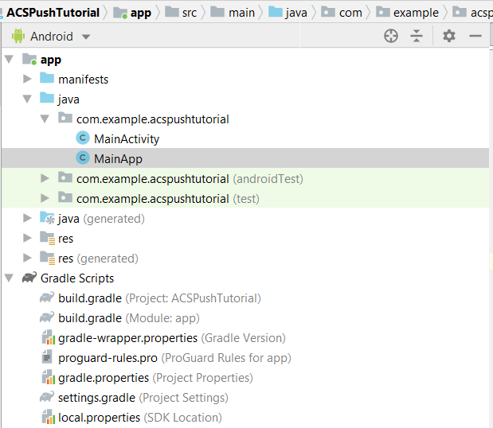

# ÉTAPE 2 - Intégration de [!UICONTROL SDK mobile] avec l’application Android

Dans cette partie, nous allons intégrer l’application [!DNL Android] à [!UICONTROL Mobile SDK]. Pour intégrer [!UICONTROL SDK mobile] à l&#39;application [!DNL Android], suivez les étapes suivantes :

* Ouvrez le projet *ACSPushTutorial* dans [!DNL Android Studio].
* Créez une nouvelle classe java appelée *MainApp* qui étend [!DNL android.app.Application]
* La structure de votre projet à ce stade doit ressembler à la suivante



* Développez le dossier [!DNL Gradle Scripts]. Doublon cliquez sur [!DNL build.gradle] du module. Collez les dépendances suivantes dans la section des dépendances du fichier [!DNL build.gradle]. Votre fichier [!DNL build.gradle] doit maintenant ressembler à ce qui suit :

<!--
Removed `{.line-numbers}` below
-->

```java
implementation 'com.adobe.marketing.mobile:campaign:1.+'
implementation 'com.adobe.marketing.mobile:userprofile:1.+'
implementation 'com.adobe.marketing.mobile:sdk-core:1.+'
```


* Synchronisez votre projet [!DNL Android] en cliquant sur le bouton Synchroniser maintenant pour synchroniser votre projet.

## Modifier [!DNL AndroidManifest.xml]{#modify-android-manifest}

Ouvrez *AndroidManifest.xml* et collez les 2 lignes suivantes après l’élément manifest et avant l’élément application. Cela permet à votre application de communiquer avec un monde extérieur

<!--
Removed `{.line-numbers}` below
-->

```xml
<uses-permission android:name="android.permission.INTERNET" />
<uses-permission android:name="android.permission.ACCESS_NETWORK_STATE" />
```

Copier la ligne suivante dans l’élément d’application
[!DNL android:name=".MainApp"]
Enregistrez votre [!DNL AndroidManifest.xml]
Votre [!DNL AndroidManifest.xml] doit ressembler à ceci

<!--
Removed `{.line-numbers}` below
-->

```xml
<?xml version="1.0" encoding="utf-8"?>
<manifest xmlns:android="http://schemas.android.com/apk/res/android"
    package="com.example.acspushtutorial">
    <uses-permission android:name="android.permission.INTERNET" />
    <uses-permission android:name="android.permission.ACCESS_NETWORK_STATE" />

<application
    android:name=".MainApp"
    android:allowBackup="true"
    android:icon="@mipmap/ic_launcher"
    android:label="@string/app_name"
    android:roundIcon="@mipmap/ic_launcher_round"
    android:supportsRtl="true"
    android:theme="@style/AppTheme">

<activity android:name=".MainActivity">
<intent-filter>
    <action android:name="android.intent.action.MAIN" />
    <category android:name="android.intent.category.LAUNCHER" />
</intent-filter>
</activity>
</application>

</manifest>
```
