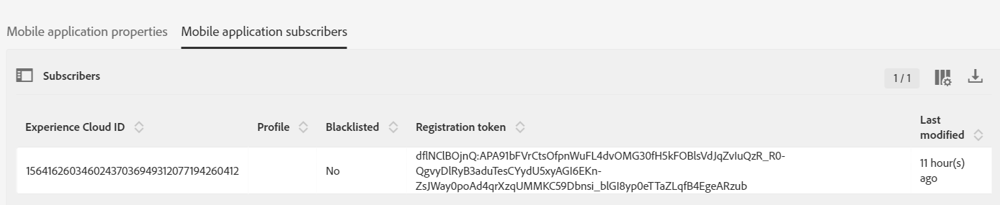

# Étape 4 - Définir le [!DNL pushidentifier]

La **[!DNL pushidentifier]** est une chaîne qui contient le jeton de l’appareil pour les notifications [!DNL Push]. Il s’agit du même jeton qui est envoyé par [!DNL Firebase] et transmis au SDK à l’aide de la méthode [!DNL MobileCore.setPushIdentifier].

Ouvrez votre projet dans [!DNL Android™]studio. Supprimez l’intégralité du code dans [!DNL MainActivity] **à l’exception de la première ligne qui est votre instruction de package**.

Collez le code suivant dans [!DNL MainActivity] :

<!--
Removed `{.line-numbers}` below
-->

```java
import androidx.annotation.NonNull;
import androidx.appcompat.app.AppCompatActivity;

import android.os.Bundle;
import android.util.Log;
import android.widget.Toast;

import com.adobe.marketing.mobile.MobileCore;
import com.google.android.gms.tasks.OnCompleteListener;
import com.google.android.gms.tasks.Task;
import com.google.firebase.iid.FirebaseInstanceId;
import com.google.firebase.iid.InstanceIdResult;

public class MainActivity extends AppCompatActivity {

@Override
protected void onCreate(Bundle savedInstanceState) {
super.onCreate(savedInstanceState);
setContentView(R.layout.activity_main);

registerToken();
}

void registerToken() {
FirebaseInstanceId.getInstance().getInstanceId()
    .addOnCompleteListener(new OnCompleteListener<InstanceIdResult>() {
        @Override
        public void onComplete(@NonNull Task<InstanceIdResult> task) {
            if (!task.isSuccessful()) {
                Log.w("Message App", "getInstanceId failed", task.getException());
                return;
            }

// Get new Instance ID token
String token = task.getResult().getToken();

Log.d("Got token", token);

MobileCore.setPushIdentifier(token);
}
});
}

@Override
public void onResume() {
super.onResume();
MobileCore.setApplication(getApplication());
MobileCore.lifecycleStart(null);
}

@Override
public void onPause() {
super.onPause();
MobileCore.lifecyclePause();
}
}
```

## Tester votre application

C’est maintenant le moment de tester votre application, avant d’aller plus loin.

* Exécutez votre application en cliquant sur la flèche verte ou sélectionnez **[!DNL Run->Run'app']**.
* L’émulateur de [!DNL Android™] doit démarrer et vous devriez voir votre application s’exécuter avec [!DNL "Hello World"]text.
* Ouvrez la fenêtre de [!DNL logcat]. Recherchez « [!DNL Got] ». Vous devriez voir le jeton qui a été reçu de [!DNL Firebase] écrit dans le journal comme illustré ci-dessous. La longue chaîne après « [!DNL Got token] » est la [!DNL pushidentifier] envoyée à Adobe Campaign.


### Vérifier les abonnés de l&#39;application mobile

Connectez-vous à votre instance Adobe Campaign Standard.
Accédez **[!UICONTROL Administration->Canaux->Application mobile (Experience Platform SDK)]**. Ouvrez l’application mobile appropriée. Accédez à l’onglet [!UICONTROL Abonnés à l’application mobile]. Un [!UICONTROL jeton d’enregistrement]répertorié devrait s’afficher.



>[!NOTE]
>
>Si vous ne voyez pas le jeton d’enregistrement dans l’onglet [!UICONTROL Abonnés à l’application mobile], STOP ici avant de continuer.
